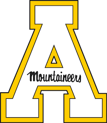

```{r setup, include=FALSE}
knitr::opts_chunk$set(echo = TRUE)
```

## About Me

School

```{r, echo=FALSE}
  knitr:: 
```

  I go to Appalachian State University. I am a Recreation Mangament Major with a minor in Statistics.


Hobbies

Some of my hobbies include playing soccer, swimming, snowboarding and things alike. I also like to spend my time outside hiking and searching for things and places to explore.

I also enjoy everything cars although on the mecahnics side I am not very knowledgable. I enjoy looking at cars as well as driving cars.

```{r, echo=FALSE}
knitr:: include_graphics()


